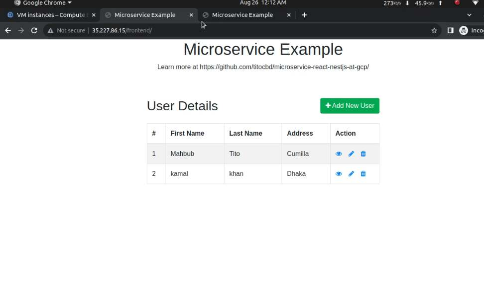
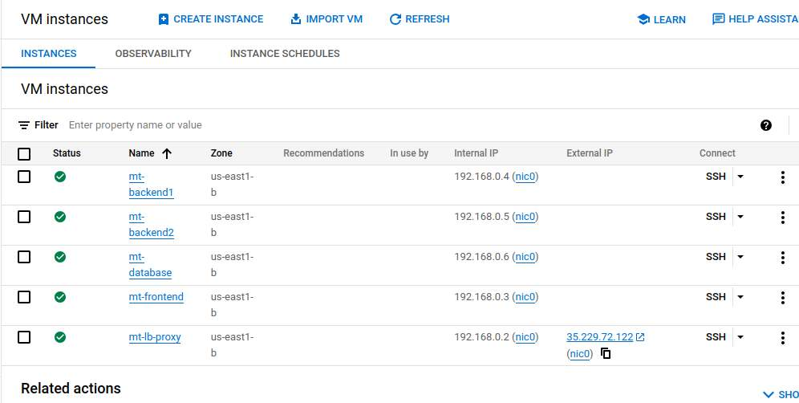

# GCP Demo - Nginx, PHP, Nestjs and Mysql 

<figure > 

  
  
Application Screen
 

</figure>

## Objective

We deploy a pure microservice architecture model at Google Cloud Platform (GCP). In this demonstration, we'll use one VPC and use five VM (virtual machine), one VM is for Load balancer, another one VM is for frontend service, two VMs for backend service and rest of VN is for database.

<figure > 

  
  
Virtual Instance at GCP
 

</figure>

## Technologies Used

1. Frontend service by php  :D
2. Backend service by Nestjs
3. MySQL Database
4. Nginx for load balancer
 

## Basic Features

1. Nginx Load balancer
2. User Create/Update/Delete

 